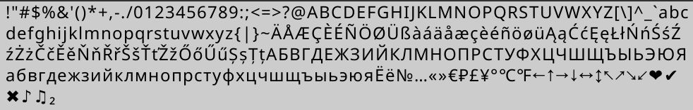

# GeekMagic SmallTV - Custom Firmware

[](/LICENSE) [](https://github.com/aydarik/geekmagic-tv-esp8266/releases) [](https://github.com/aydarik/geekmagic-tv-esp8266/releases) [](https://www.buymeacoffee.com/aydarik)

ESP8266 firmware compatible with the GeekMagic API, designed for GeekMagic SmallTV devices.

> [!NOTE]
> This project is originally a fork of [bvweerd/geekmagic-tv-esp8266](https://github.com/bvweerd/geekmagic-tv-esp8266),
> huge thanks to [@bvweerd](https://github.com/bvweerd) for this amazing work ❤️
>
> It started as a personal learning/experimentation project. Due to significant architectural changes, it is **not
intended to stay in sync** with the upstream repository.


> [!WARNING]
> **SmallTV** and **SmallTV-Ultra** utilize an ESP8266. The **SmallTV-Pro** uses an ESP32.
> This firmware is strictly for **ESP8266-based devices**. Testing was done on the SmallTV Ultra.
>
> **Flashing custom firmware is at your own risk.**

## Home Assistant

You can integrate the device with Home Assistant using [hass-geekmagic](https://github.com/aydarik/hass-geekmagic) HACS
add-on:

[](https://my.home-assistant.io/redirect/supervisor_add_addon_repository/?repository_url=https%3A%2F%2Fgithub.com%2Faydarik%2Fhass-addons)

## 🛠️ Installation

### First Flash (UART Required ⚠️)

Since initial devices come with factory firmware, the **first** flash must be done via serial.

1. Connect your device via USB/Serial.
2. Recommended tool: [web.esphome.io](https://web.esphome.io/)
3. Flash the `firmware.bin` from the latest release.

Please check the instructions in the original repository for more
details: [FLASHING.md](https://github.com/bvweerd/geekmagic-tv-esp8266/blob/dev/FLASHING.md)

<details>
<summary>Looks messy, but works 🫢</summary>

 

</details>

### Bootstrapping

1. Device starts in AP mode.
2. Check the display for the **AP Credentials** ((SSID, password).
3. Connect and navigate to the shown IP address (typically `192.168.4.1`).
4. Configure your Wi-Fi credentials on the Web UI.
5. Device will restart and connect to your network.
6. The new assigned IP address will be shown at startup and at the top of the clock screen. You can now navigate to it
   to access the Web UI:


_Optional:_ configure a static IP for the device on your router, so it won’t be reassigned after restarts.

## 🔄 OTA Updates

1. Navigate to your device's IP
2. Click on `Firmware Update (OTA)` at the bottom ot the page.
2. Select `firmware.bin`
3. Upload

## 💬 Supported Characters



## 📡 HTTP API

If you are not using Home Assistant, you can still automate your device via simple HTTP calls.

### Display Control

```bash
# Set brightness
curl "http://DEVICE_IP/set?brt=50"

# Change theme
curl "http://DEVICE_IP/set?theme=1"

# Toggle seconds display
curl "http://DEVICE_IP/set?sec=true"
```

### Messaging & Notifications

```bash
# Show custom message (Hello world! \n Привет, мир!)
curl "http://DEVICE_IP/set?msg=Hello%20world!%0A%D0%9F%D1%80%D0%B8%D0%B2%D0%B5%D1%82%2C%20%D0%BC%D0%B8%D1%80!%0A&sbj=Notification&style=center&timeout=10"

# Show gauge (21.4/40 ℃)
curl 'http://DEVICE_IP/set?msg=21.4%2F40%20%E2%84%83&sbj=Living%20room&style=big_num&timeout=60'

# Set a sticky note on the clock screen (+8℃, cloudy \n 20.3℃ | 63% \n CO₂ 857 ppm)
# Multiline notes rotate within a minute)
curl "http://DEVICE_IP/set?note=%252B8%E2%84%83%2C%20cloudy%0A20.3%E2%84%83%20%7C%2063%25%0ACO%E2%82%82%20857%20ppm&rpm=6&force=false&timeout=3600"
```

  

### Countdown

```bash
# Start a countdown to the specific date and time
curl "http://DEVICE_IP/set?cnt=2026-02-19T09%3A30&sbj=Next%20call&timeout=5"
```


### Filesystem & Images

```bash
# Upload an image file
curl -F "file=@photo.jpg" "http://DEVICE_IP/doUpload?dir=/image/"

# Display an uploaded image
curl "http://DEVICE_IP/set?img=/image/photo.jpg&timeout=30"

# List files (returns an HTML table for factory firmware compatibility)
curl "http://DEVICE_IP/filelist"
```

### System

```bash
# Get firmware version
curl "http://DEVICE_IP/v.json"

# Get device status
curl "http://DEVICE_IP/app.json"

# Get FS space info
curl "http://DEVICE_IP/space.json"

# Get Heap usage info
curl "http://DEVICE_IP/memory.json"

# View logs
curl "http://DEVICE_IP/log"
```

## 📜 License

This project is licensed under the MIT License - see the [LICENSE](/LICENSE) file for details.
